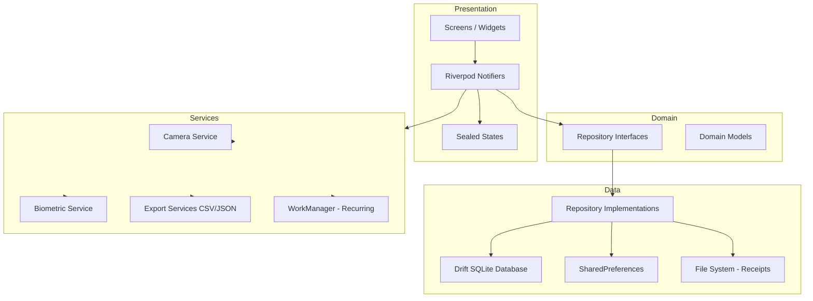
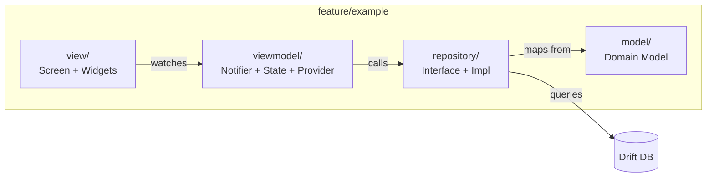
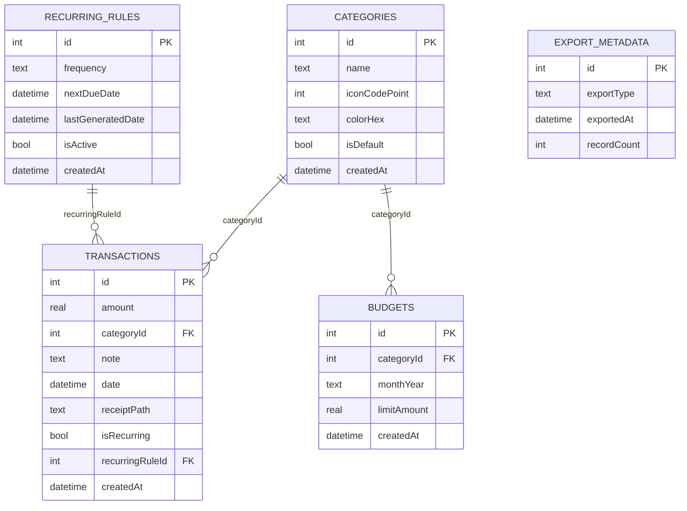
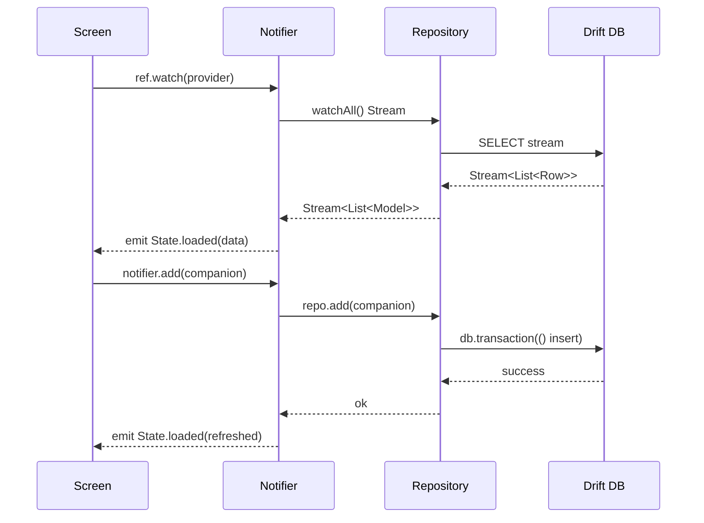
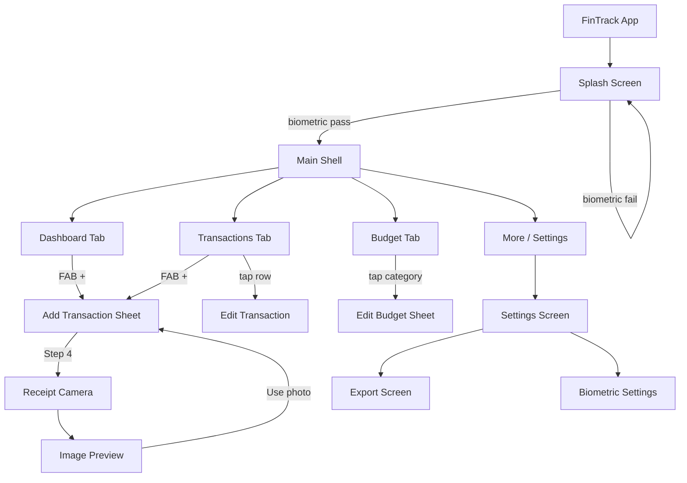

# FinTrack Pro — Offline Edition

> A fully offline personal finance tracker built with Flutter.
> No internet. No cloud. Your data stays on your device.

---

## Table of Contents

- [Download APK](#download-apk)
- [Screenshots](#screenshots)
- [Demo Video](#demo-video)
- [Architecture Overview](#architecture-overview)
- [Folder Structure](#folder-structure)
- [Feature Architecture — MVVM + Repository](#feature-architecture)
- [Database Schema](#database-schema)
- [State Management Flow](#state-management-flow)
- [Navigation Flow](#navigation-flow)
- [Decision Log](#decision-log)
- [Setup Instructions](#setup-instructions)
- [Running Tests](#running-tests)
- [Building the APK](#building-the-apk)
- [Offline Verification](#offline-verification)
- [Known Limitations](#known-limitations)

---

## Download APK

**[Download app-release.apk (Google Drive)](https://drive.google.com/file/d/15GtgeaOrzM9yxZh1O_SoT801QrBgy6vb/view?usp=sharing)**

Install on Android: open the APK from Downloads, allow install from that source if prompted, then open **FinTrack Pro**. For day-to-day installs, prefer builds you compile yourself (see [Building the APK](#building-the-apk)).

---

## Screenshots

Full-size captures on Google Drive:

| Dashboard | Transactions | Budget | Settings |
|-----------|----------------|--------|----------|
| [Open image](https://drive.google.com/file/d/15WXxDqWcotnQu5Ko_mkN9Jxy9cfcaqjw/view?usp=sharing) | [Open image](https://drive.google.com/file/d/16mdMGk8ZO5NVdwNfn_-HxkH_KFjRXaXH/view?usp=sharing) | [Open image](https://drive.google.com/file/d/1pkIFK75FAB1HHadDoZnMuEh__ljFv9XQ/view?usp=sharing) | [Open image](https://drive.google.com/file/d/1uqwpfNPSi2uH98KZ5aZJqTQ0gMqAHO8N/view?usp=sharing) |

---

## Demo Video

**[Watch demo video (Google Drive)](https://drive.google.com/file/d/1LghvfCqqAZxQOOOQEwR3A4b9MS2HjPeX/view)**

GitHub’s README renderer does not support embedded players for Google Drive (it strips `<iframe>` / most HTML video). The link above opens the recording in your browser. For an inline preview on the repo front page, upload the same clip to **YouTube** (or **GitHub Releases** as an asset) and we can add a standard embed or thumbnail link for that host.

---

## Architecture Overview



---

## Folder Structure

```
lib/
├── core/
│   ├── config/
│   │   ├── app_routes.dart         # Named route constants
│   │   ├── app_theme.dart          # Material 3 ThemeData light + dark
│   │   ├── locale_notifier.dart    # Language preference + Locale
│   │   ├── theme_mode_notifier.dart
│   │   └── user_display_name_notifier.dart
│   ├── constants/
│   │   ├── app_assets.dart          # Asset paths (e.g. splash logo)
│   │   ├── app_strings.dart       # Fallback string constants
│   │   ├── app_colors.dart        # Static color constants
│   │   ├── budget_seed.dart       # Default category budget values
│   │   ├── category_icon_assets.dart
│   │   └── db_constants.dart      # Table + column name constants
│   ├── services/
│   │   ├── database/
│   │   │   └── tables/            # Drift table definitions (5 tables)
│   │   ├── biometric/             # local_auth wrapper
│   │   ├── export/                # CSV + JSON export services
│   │   ├── storage/               # SharedPreferences wrapper
│   │   └── work/                  # WorkManager recurring job
│   ├── utils/
│   │   ├── category_localizations.dart
│   │   ├── currency_formatter.dart
│   │   ├── date_formatter.dart
│   │   ├── validators.dart
│   │   └── extensions.dart
│   └── widgets/
│       ├── animated_card.dart
│       ├── category_icon.dart
│       └── shimmer_skeleton.dart
│
├── features/
│   ├── dashboard/                 # Charts, flip card, summary
│   ├── transactions/              # CRUD, 5-step add flow
│   ├── budget/                    # Per-category limits
│   ├── receipt/                   # Camera capture + preview
│   ├── export/                    # CSV / JSON export
│   └── settings/                  # Theme, language, biometric
│
├── ui/
│   ├── shell/
│   │   └── main_shell.dart        # Bottom nav + IndexedStack
│   └── splash/
│       └── splash_page.dart       # Biometric gate + launch
│
├── generated/
│   └── database/                  # Drift: app_database.dart + .g.dart
│
├── l10n/                          # Generated AppLocalizations (from ARB)
└── main.dart
```

---

## Feature Architecture

Every feature follows the same 4-layer pattern:



### Layer responsibilities

| Layer | Responsibility |
|-------|---------------|
| **model/** | Pure Dart data classes. `fromDrift()` factory. `copyWith()`. No UI imports. |
| **repository/** | Abstract interface + implementation. All DB queries live here. Streams for reactive UI. |
| **viewmodel/** | Notifier holds business logic. Sealed state classes. Providers expose state to UI. |
| **view/** | Screens and widgets. Read-only consumers of state. Call notifier methods on user action. |

---

## Database Schema



### Schema decisions

- `amount` is always stored as a signed `real`:
  negative = expense, positive = income.
  No separate `type` column needed.
- `receiptPath` stores local file path string only.
  Never stores image bytes in DB.
- `budgets` uses `(categoryId, monthYear)` unique constraint
  so each category has exactly one budget per month.
- Foreign keys use `cascade delete` so deleting a category
  removes all its transactions automatically.
- Schema is versioned in `app_database.dart` (currently **v6**);
  migrations from earlier versions add budgets, recurring fixes,
  category palette updates, and related data hygiene.

---

## State Management Flow



### Why Riverpod over BLoC

| Concern | BLoC | Riverpod |
|---------|------|----------|
| Boilerplate | Very high — Event + State + Bloc classes | Low — single Notifier class |
| MVVM fit | Forced, unnatural | Natural match |
| Repository pattern | Works but verbose | Clean, direct |
| Compile-time safety | Partial | Full with code generation |
| Testability | Good | Good |
| Interview signal | Followed spec blindly | Made justified choice |

The task document said "BLoC or Riverpod" — Riverpod was chosen
because it produces cleaner architecture with less code
for this project scope.

---

## Navigation Flow



### Navigation decisions

- `MainShell` uses `IndexedStack` — tabs preserve scroll position
  and don't rebuild on switch.
- Add transaction is a full-screen overlay scaffold in the shell stack
  — dashboard stays alive underneath.
- Receipt camera is a full route push so it can return a result
  (`Navigator.pop(context, imagePath)`) back to the add flow.
- The 5-step flow uses explicit Back/Next — users advance through
  controls rather than free-form paging where that would skip validation.

---

## Decision Log

### 1. Flutter + Dart

**Decision:** Build with Flutter.
**Reason:** Cross-platform (Android + iOS) from one codebase.
Task requirement was Android APK + iOS support.

---

### 2. Riverpod (Notifier pattern)

**Decision:** Riverpod 3 with `Notifier` + `NotifierProvider`.
**Reason:** Lower boilerplate than BLoC while maintaining clean
repository separation. Task allowed BLoC or Riverpod.
Riverpod's compile-time safety catches provider errors at build time.

---

### 3. Drift (SQLite)

**Decision:** Drift over Hive.
**Reason:** Task required foreign key constraints and transaction
rollbacks — Hive is key-value only and cannot support either.
Drift generates type-safe query code and supports complex JOINs
needed for budget + spending aggregation.

---

### 4. CustomPainter for charts

**Decision:** All charts (donut, bar) use CustomPainter.
**Reason:** Task explicitly required CustomPainter with hit testing.
No chart library dependencies means smaller APK and full control
over animation and rendering.

---

### 5. Receipt as file path

**Decision:** Store receipt image as local file path string in DB.
Not as bytes (BLOB).
**Reason:** Storing images as BLOBs inflates DB size rapidly.
File path approach keeps DB lightweight.
Auto-repair logic handles broken paths (`File(path).exists()`).

---

### 6. Budget per category per month

**Decision:** `budgets` table with `(categoryId, monthYear)` unique key.
**Reason:** Allows historical budget tracking — you can view what
your Food budget was in March vs May.
`insertOrReplace` makes upsert trivial.
Seeds current month on first launch and on month change.

---

### 7. WorkManager for recurring transactions

**Decision:** WorkManager periodic task every 24 hours.
**Reason:** WorkManager is the Android-recommended way to schedule
background work that must survive app restarts.
Minimum OS-enforced interval is 15 minutes — registered as 24h.
Task processes only rules where `nextDueDate <= now`.

---

### 8. Localization — English + Hindi

**Decision:** Flutter's built-in `flutter_localizations` + ARB files.
**Reason:** Native l10n support, no third-party dependency.
Language switching updates locale provider immediately — no restart.
Hindi covers the primary non-English user base in India.

---

### 9. Biometric gate on splash

**Decision:** Check `isBiometricEnabled` on every cold launch.
**Reason:** Protects financial data without requiring a PIN system.
Uses `local_auth` with `stickyAuth: true` so device lock screen
is used as fallback when biometrics fail.

---

### 10. MVVM-style folder structure

**Decision:** `model / repository / viewmodel / view` per feature.
**Reason:** Clean separation of concerns. Repository layer is
independently testable without UI. Notifiers are testable without
widgets. Models have no Flutter imports — pure Dart.

---

## Setup Instructions

### Requirements

- Flutter 3.29+
- Dart 3.x
- Android Studio / VS Code
- Java 17 (for Gradle)

### Steps

```bash
# 1. Clone the repo
git clone https://github.com/shreyai347/fintrack
cd fintrack

# 2. Install dependencies
flutter pub get

# 3. Generate Drift database code
dart run build_runner build --delete-conflicting-outputs

# 4. Generate localization files
flutter gen-l10n

# 5. Run the app
flutter run
```

---

## Running Tests

```bash
flutter test
```

### Test coverage

| File | What is tested |
|------|---------------|
| `currency_formatter_test.dart` | format, parse |
| `date_formatter_test.dart` | formatDisplay, formatShort, formatGroupHeader |
| `validators_test.dart` | amount validation, note validation |
| `dashboard_summary_model_test.dart` | budgetUsedPercent, isOverWarning, isCritical |
| `budget_model_test.dart` | usedPercent, isOverBudget, remaining, monthYearDisplay |
| `transaction_model_test.dart` | copyWith, amount sign |
| `csv_export_service_test.dart` | buildCsvRows headers + rows |
| `json_export_service_test.dart` | buildJsonPayload structure |

---

## Building the APK

```bash
flutter clean
flutter pub get
flutter build apk --release \
  --target-platform android-arm64 \
  --no-tree-shake-icons
```

APK output when you build locally:

`build/app/outputs/flutter-apk/app-release.apk`

**Pre-built APK (same artifact, hosted):** [app-release.apk on Google Drive](https://drive.google.com/file/d/15GtgeaOrzM9yxZh1O_SoT801QrBgy6vb/view?usp=sharing)

> `--no-tree-shake-icons` is required because category icons use
> runtime `IconData(codePoint)` loaded from the database.
> Tree-shaking cannot statically analyze runtime icon codes.

---

## Offline Verification

Enable **airplane mode** on device before launching.
All features work with zero internet:

| Feature | Works offline |
|---------|--------------|
| Add / edit / delete transactions | ✅ |
| Dashboard charts | ✅ |
| Budget tracking | ✅ |
| Receipt camera capture | ✅ |
| Export CSV / JSON | ✅ |
| QR summary | ⚠️ UI shows “coming soon”; CSV/JSON export works |
| Biometric lock | ✅ |
| Hindi / English switch | ✅ |
| Recurring transactions | ✅ |
| Dark / Light theme | ✅ |

---

## Known Limitations

- Camera preview does not work on Android emulator.
  Use a real device for receipt scanning.
- WorkManager minimum interval is 15 minutes (OS enforced)
  even when registered as 24 hours.
- `--no-tree-shake-icons` slightly increases APK size.
  Can be removed if categories are refactored to use const icons.
- Backup & restore is scaffolded but not yet implemented.
  JSON export covers manual backup use case.
